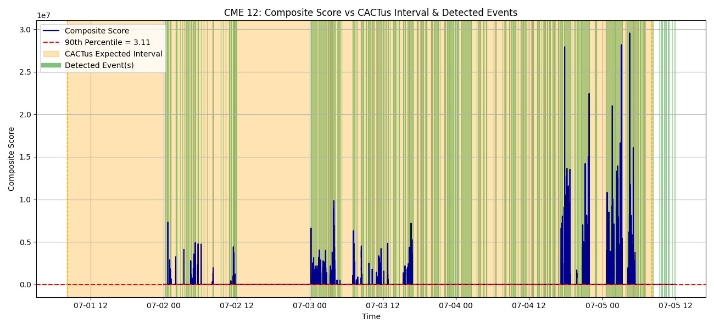

# ☀️ Halo CME Detection using Aditya-L1 SWIS-ASPEX Data

This project focuses on detecting **Halo Coronal Mass Ejections (CMEs)** using **particle flux data from the SWIS-ASPEX payload** onboard **ISRO's Aditya-L1 mission**. It aligns and analyzes in-situ measurements to flag potential CME events and validates them against the **CACTus Halo CME catalog**.

---

## 📌 Problem Statement (PS-10)

> Identify Halo CME Events Based on Particle Data from SWIS-ASPEX Payload onboard Aditya-L1

Sudden changes in solar wind particle flux can indicate CME activity. Early detection enables **timely space weather alerts**, crucial for protecting satellites, communication systems, power infrastructure, and other space assets.

---

## 🧠 Our Approach

### 🔹 Data Sources
- **SWIS-ASPEX Level-2 CDF files** (Bulk, TH1, TH2)
- **CACTus Halo CME Catalog** (for validation)

### 🔹 Key Parameters Considered
- `proton_bulk_speed`, `proton_density`, `proton_thermal`
- `composite_flux`, `alpha_proton_ratio`
- `proton_xvelocity`, `yvelocity`, `zvelocity`
- `velocity_magnitude`

### 🔹 Detection Pipeline
1. **CDF → CSV conversion** using `spacepy`
2. **Data Cleaning & Merging** into a unified dataset
3. **Composite Scoring** using rolling z-scores with weighted parameters
4. **Anomaly Detection** via adaptive percentile thresholds
5. **Noise Filtering** to eliminate weak/noisy bursts
6. **Interval Merging** for temporally close events
7. **Strength Categorization** (Weak / Moderate / Strong)
8. **Validation** with CACTus catalog (optional)

---

## 📁 Project Structure


```
Halo-CME-Detection/
├── Data/
│   └── AL1_ASW91_L2_TH1_20250628_UNP_9999_999999_V02.cdf   # Example CDF data file
├── scripts/
│   ├── cdf_to_csv.py                 # Converts CDF files to CSV
│   ├── data_preparation.py           # Cleans and merges CSVs into final dataset
│   ├── halo_cme_detection.py         # Main detection pipeline
│   ├── plot_scores.py                # Plots Time vs Composite Score for each CME
│   └── visualize_with_catalog_overlay.py # Plots composite score with CACTus and detected overlays for all CMEs
├── main.py                           # (Optional) Entrypoint for running the pipeline
├── requirements.txt                  # Python dependencies
├── README.md                         # Project documentation
```

**Directory Notes:**
- `Data/` contains raw CDF files and any processed data outputs.
- `scripts/` holds all main processing and analysis scripts.
- `plots/` (if present) will contain generated visualizations.
- Output CSVs (e.g., `final_dataset.csv`, `detected_halo_cmes.csv`) are saved in the appropriate data folders.
Edit
---

## 🛠️ How to Run

### 1️⃣ Install Requirements

```bash
pip install -r requirements.txt
```

### 2️⃣ Convert CDF to CSV

```bash
python scripts/cdf_to_csv.py
```

### 3️⃣ Merge & Prepare Final Dataset

```bash
python scripts/data_preparation.py
```

### 4️⃣ Run CME Detection

```bash
python scripts/halo_cme_detection.py
```

### 5️⃣ Generate Visual Plots

```bash
python scripts/visualization.py
```

---

## 📊 Output & Visualization

- All plots are saved in the `plots/` directory:
  - `CME_<number>_composite_score.png`: Time vs Composite Score for each CME (from `plot_scores.py`)
  - `cme_<number>_overlay_with_detected.png`: Composite Score with CACTus expected interval (orange) and detected events (green) for each CME (from `visualize_with_catalog_overlay.py`)
  - `*_overlay.png`: (if present) Composite Score with CACTus intervals
  - `cme_strength_distribution.png`: Histogram of CME strengths (Weak/Moderate/Strong)

**Example:**

<p align="center">  </p>

---

## ✅ Final Output

- 📄 `detected_halo_cmes.csv`: List of detected CME intervals with strength classification
- 📊 Per-event plots to support interpretation
- 🧠 Algorithmic detection based on dynamic particle variations

---

## 🚀 Highlights

- ✅ Data-driven, India-centric space solution
- 🧩 Adaptive z-score thresholding for robust anomaly detection
- 🔄 Merging logic to prevent over-fragmentation of events
- ⚙️ Fully scriptable and reproducible workflow
- 📊 Rich visual and statistical outputs for analysis

---

## 🧰 Tools & Libraries Used

- pandas, numpy
- matplotlib, seaborn
- spacepy (for reading CDF files)
- scipy, tqdm

---

## 📬 Acknowledgements

- ISRO Aditya-L1 Mission & SWIS-ASPEX Team
- SIDC/CACTus for providing the Halo CME catalog
- Bharat Antriksh Hackathon by ISRO & iHUB DivyaSampark

---
�📈 Future Improvements
- Add velocity vector direction change analysis
- Integrate real-time streaming data support
- Develop a web-based dashboard or alert system
- Explore machine learning-based trend modeling

