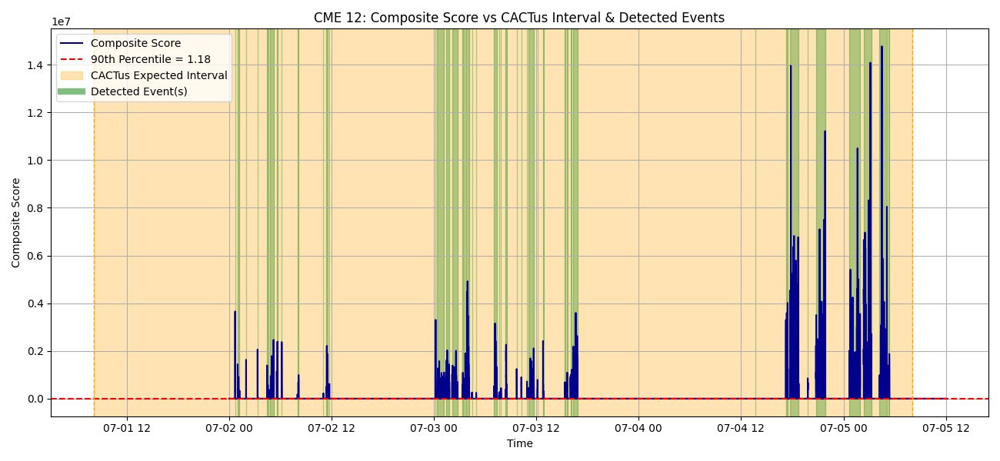
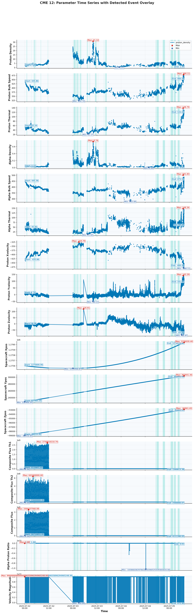
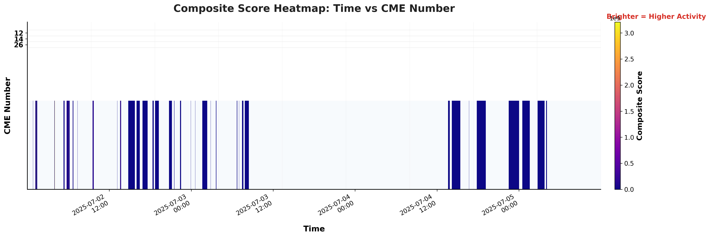
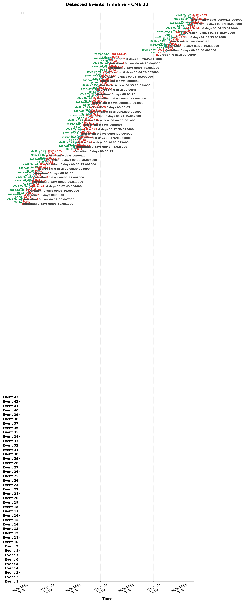
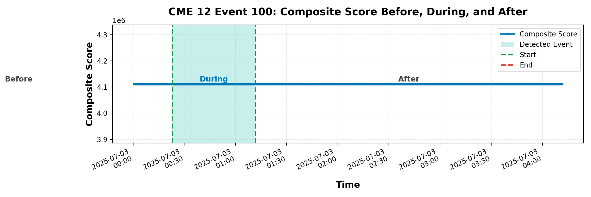
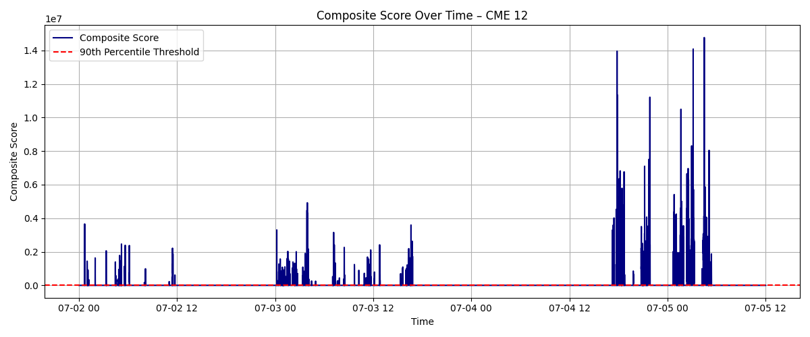

# ☀️ Halo CME Detection using Aditya-L1 SWIS-ASPEX Data

This project implements an automated pipeline for the detection and characterization of **Halo Coronal Mass Ejections (CMEs)** using **in-situ solar wind plasma and suprathermal particle data** from the **SWIS-ASPEX instrument** aboard **ISRO's Aditya-L1 mission**. The workflow leverages advanced statistical anomaly detection, multi-parameter composite scoring, and cross-validation with the **CACTus Halo CME catalog** to robustly identify heliospheric transients and quantify their properties.

---

## 📌 Problem Statement (PS-10)


> Develop a robust, physics-informed methodology to autonomously identify and characterize Halo CME events based on time-resolved, multi-channel solar wind plasma and suprathermal ion data from the SWIS-ASPEX payload onboard Aditya-L1. The approach should maximize sensitivity to CME-driven heliospheric disturbances while minimizing false positives from background solar wind variability.

Sudden, large-amplitude enhancements in solar wind particle flux, velocity, and composition are canonical signatures of CME-driven shocks and ejecta. Early, automated detection of such heliospheric disturbances is critical for **space weather forecasting**, enabling proactive mitigation of geomagnetic storms that threaten satellite operations, GNSS reliability, and ground-based infrastructure.

---

## 🧠 Our Approach

### 🔹 Data Sources
- **SWIS-ASPEX Level-2 CDF files** (Bulk, TH1, TH2): Proton/alpha flux, velocity vectors, thermal speeds, and derived quantities at high cadence
- **CACTus Halo CME Catalog**: Reference catalog for event validation and benchmarking

### 🔹 Key Physical Parameters
- `proton_bulk_speed`, `proton_density`, `proton_thermal`: Core solar wind plasma diagnostics
- `composite_flux`, `alpha_proton_ratio`: Suprathermal ion composition and energetic particle enhancements
- `proton_xvelocity`, `yvelocity`, `zvelocity`, `velocity_magnitude`: Vectorial solar wind flow and CME kinematics

### 🔹 Detection & Analysis Pipeline
1. **CDF → CSV conversion** using `spacepy`: Parse and extract high-cadence, multi-channel plasma/particle data
2. **Data Cleaning & Merging**: Synchronize, interpolate, and quality-control all physical parameters into a unified time series
3. **Composite Scoring**: Compute a weighted, rolling z-score-based composite anomaly metric across all key parameters
4. **Anomaly Detection**: Identify statistically significant excursions using adaptive, percentile-based dynamic thresholds
5. **Noise Filtering**: Suppress spurious detections via minimum duration and amplitude criteria
6. **Interval Merging**: Merge temporally adjacent or overlapping intervals to reconstruct extended CME events and substructure
7. **Strength Categorization**: Quantify event intensity (Weak/Moderate/Strong) based on integrated flux enhancement and duration
8. **Validation**: Cross-match detected events with CACTus catalog for benchmarking, false positive/negative analysis, and scientific interpretation

---

## 📁 Project Structure

```
Halo-CME-Detection/
├── Data/
│   └── ...
├── scripts/
│   ├── cdf_to_csv.py
│   ├── data_preparation.py
│   ├── halo_cme_detection.py
│   ├── plot_scores.py
│   ├── timeline_plot.py
│   ├── visualize_with_catalog_overlay.py
│   ├── plot_params_overlay.py
│   ├── composite_score_heatmap.py
│   ├── composite_score_before_after.py
│   ├── visualize_scores.py
│   ├── organize_plots.py
│   └── organize_visualize_scores.py
├── main.py
├── requirements.txt
├── README.md
├── plots/
│   ├── params_overlay/           # Parameter overlays per CME
│   ├── heatmaps/                # Composite score heatmaps
│   ├── before_after/            # Composite score before/during/after CME
│   ├── plot_scores/             # Time vs Composite Score plots
│   ├── timeline/                # Timeline plots for each CME
│   ├── catalog_overlay/         # Catalog overlay plots
│   └── visualize_scores/        # Plots from visualize_scores.py
└── data/
    ├── final_dataset.csv
    ├── detected_halo_cmes.csv
    └── ...
```

**Directory Notes:**
- `Data/`: Raw CDF files, processed time series, and derived event catalogs
- `scripts/`: All core data ingestion, transformation, detection, and visualization modules (Python)
- `plots/`: Hierarchically organized output visualizations (see below)
- Output CSVs (e.g., `final_dataset.csv`, `detected_halo_cmes.csv`): Final, analysis-ready datasets and event lists
Edit
---


## � Quick Start

1. **Clone the repository and install requirements:**
   ```bash
   git clone <repo-url>
   cd Halo-CME-Detection
   pip install -r requirements.txt
   ```

2. **Convert CDF to CSV:**
   ```bash
   python scripts/cdf_to_csv.py
   ```

3. **Prepare the final dataset:**
   ```bash
   python scripts/data_preparation.py
   ```

4. **Run the CME detection pipeline:**
   ```bash
   python scripts/halo_cme_detection.py
   ```

5. **Generate all visualizations:**
   - Run each plotting script in `scripts/` as needed, e.g.:
     ```bash
     python scripts/plot_params_overlay.py
     python scripts/composite_score_heatmap.py
     python scripts/timeline_plot.py
     python scripts/visualize_with_catalog_overlay.py
     python scripts/composite_score_before_after.py
     python scripts/visualize_scores.py
     ```

6. **Organize your plots:**
   - To keep the `plots/` directory tidy, run:
     ```bash
     python scripts/organize_plots.py
     python scripts/organize_visualize_scores.py
     ```

---

### 1️⃣ Install Requirements

```bash
pip install -r requirements.txt
```

### 2️⃣ Convert CDF to CSV

```bash
python scripts/cdf_to_csv.py
```

### 3️⃣ Merge & Prepare Final Dataset

```bash
python scripts/data_preparation.py
```

### 4️⃣ Run CME Detection

```bash
python scripts/halo_cme_detection.py
```

### 5️⃣ Generate Visual Plots

```bash
python scripts/visualization.py
```

---


## 📊 Output & Visualization Products

All plots are now saved in organized subfolders under `plots/`:

- `params_overlay/`: Parameter time series overlays for each CME
- `heatmaps/`: Composite score heatmaps (time vs CME number)
- `before_after/`: Composite score before/during/after CME event
- `plot_scores/`: Time vs Composite Score for each CME
- `timeline/`: Timeline plots for each CME
- `catalog_overlay/`: Composite score overlays with CACTus and detected intervals
- `visualize_scores/`: Plots from `visualize_scores.py`


**Visualization Gallery (Physics Context):**

<details>
<summary><b>Click to expand example plots</b></summary>

<p align="center">
  
  <br><i>Composite anomaly score (multi-parameter) with CACTus catalog and detected CME intervals</i>
</p>
<p align="center">
  
  <br><i>Time-resolved plasma and suprathermal ion parameter overlay for CME 12</i>
</p>
<p align="center">
  
  <br><i>Composite anomaly score heatmap: CME number vs. time (reveals periods of heliospheric activity)</i>
</p>
<p align="center">
  
  <br><i>Event timeline: Detected CME intervals, durations, and substructure</i>
</p>
<p align="center">
  
  <br><i>Composite anomaly score before, during, and after CME: pre/post-event heliospheric context</i>
</p>
<p align="center">
  
  <br><i>Composite anomaly score time series for individual CME (debug/diagnostic view)</i>
</p>
</details>

---


## ✅ Final Output & Deliverables

- 📄 `detected_halo_cmes.csv`: Catalog of detected CME intervals with strength classification, start/end times, and parameter statistics
- 📊 Per-event and per-parameter visualizations for scientific interpretation and validation
- 🧠 Algorithmic detection and scoring based on multi-parameter, time-resolved solar wind and suprathermal ion data

---


## 🚀 Key Features & Technical Highlights

- ✅ Physics-driven, India-centric heliophysics solution leveraging in-situ plasma and suprathermal particle measurements
- 🧩 Adaptive rolling z-score thresholding for robust detection of non-Gaussian, transient solar wind anomalies
- 🔄 Temporal clustering and interval merging to resolve CME substructure and prevent event over-segmentation
- ⚙️ Fully scriptable, modular, and reproducible data analysis pipeline (Pythonic, vectorized, and batch-friendly)
- 📊 Multi-modal visualizations: time series overlays, composite score heatmaps, CME event timelines, and pre/post-event anomaly diagnostics
- �️ Utilizes Level-2 SWIS-ASPEX data: proton/alpha flux, bulk velocity vectors, thermal speeds, and derived composite flux metrics
- 🧮 Incorporates CACTus catalog cross-validation for event association and false positive/negative analysis
- 🏷️ Event strength classification based on integrated particle flux enhancement and duration (Weak/Moderate/Strong)
- 📈 Statistical outputs: percentile-based anomaly scoring, event duration histograms, parameter correlation matrices

---


## 🧰 Tools & Scientific Libraries

- `pandas`, `numpy`: Data wrangling, vectorized computation
- `matplotlib`, `seaborn`: Scientific visualization
- `spacepy`: CDF file parsing, time series extraction
- `scipy`, `tqdm`: Signal processing, progress monitoring

---


## 📬 Acknowledgements & Credits

- ISRO Aditya-L1 Mission & SWIS-ASPEX Science Team
- SIDC/CACTus (Solar Influences Data Analysis Center) for the Halo CME reference catalog
- Bharat Antriksh Hackathon (ISRO & iHUB DivyaSampark) for the challenge framework

---

## 📈 Future Improvements
- Incorporate velocity vector direction change analysis
- Add real-time streaming data support
- Develop interactive dashboards and advanced comparative visualizations
- Expand catalog validation and event classification
- Explore machine learning-based event detection
- NOW ENJOY!
- 

