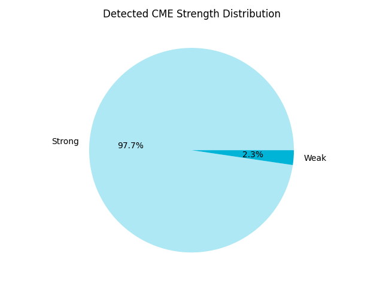

# ☀️ Halo CME Detection using Aditya-L1 SWIS-ASPEX Data

This project focuses on detecting **Halo Coronal Mass Ejections (CMEs)** using **particle flux data from the SWIS-ASPEX payload** onboard **ISRO's Aditya-L1 mission**. The solution aligns and analyzes in-situ measurements to flag possible CME events, validating them against the **CACTus Halo CME catalog**.

---

## 📌 Problem Statement (PS-10)

> Identify Halo CME Events Based on Particle Data from SWIS-ASPEX Payload onboard Aditya-L1

A sudden change in solar wind particle flux can indicate a potential CME. Detecting these changes in advance enables early warnings for space weather events that impact satellites, communication, and power grids.

---

## 🧠 Our Approach

### 🔹 Data Sources:
- **SWIS-ASPEX Level-2 CDF files** (bulk, TH1, TH2)
- **CACTus Halo CME Catalog** for reference validation

### 🔹 Key Parameters:
- `proton_bulk_speed`, `proton_density`, `proton_thermal`
- `composite_flux`, `alpha_proton_ratio`
- `proton_xvelocity`, `yvelocity`, `zvelocity`
- `velocity_magnitude`

### 🔹 Detection Pipeline:
1. **CDF → CSV** conversion using `spacepy`
2. **Data Cleaning & Merging** (final unified dataset)
3. **Composite Scoring** based on rolling z-scores with weighted parameters
4. **Anomaly Detection** using adaptive percentile thresholds
5. **Noise Filtering** (weak/noisy bursts removed)
6. **Interval Merging** (merge close detections)
7. **Strength Categorization** (based on score)
8. **Validation** with CACTus catalog (optional)

---

## 📁 Project Structure

Halo-CME-Detection/
├── data/
│ ├── cactus/ # CACTus halo CME catalog
│ ├── raw_cdf/ # Original CDF files
│ ├── swis_csv/ # Converted CSVs
│ ├── final_dataset.csv # Merged dataset used for analysis
│ └── detected_halo_cmes.csv # Final output
├── plots/ # Generated visual plots
├── scripts/
│ ├── cdf_to_csv.py
│ ├── data_preparation.py
│ ├── halo_cme_detection.py
│ └── visualization.py
├── .gitignore
└── README.md

---

## 🛠️ How to Run

### 1️⃣ Install Requirements
```bash
pip install -r requirements.txt
2️⃣ Convert CDF to CSV

python scripts/cdf_to_csv.py
3️⃣ Merge & Prepare Final Dataset

python scripts/data_preparation.py
4️⃣ Run CME Detection

python scripts/halo_cme_detection.py
5️⃣ Generate Visual Plots

python scripts/visualization.py
📊 Visual Outputs
All plots are saved in the plots/ directory.

*_overlay.png: Composite Score + CACTus window

*_overlay_with_detected.png: CACTus (orange) + Detected (green)

cme_strength_distribution.png: Strong/Moderate/Weak event histogram

Example:

<p align="center">  </p>
✅ Final Output
📄 detected_halo_cmes.csv: Detected CME intervals with strength classification

📊 Plots per CME for interpretation

🧠 Algorithm detects events based on real particle variations

🚀 Highlights
✅ Data-driven, India-centric space solution

🧩 Adaptive z-score thresholding for anomaly detection

🔄 Merging logic to avoid over-segmentation

⚙️ Fully scriptable and reproducible pipeline

📊 Visual and statistical outputs included

📌 Tools & Libraries Used
pandas, numpy

matplotlib, seaborn

spacepy (CDF reading)

scipy

tqdm

📬 Acknowledgements
ISRO Aditya-L1 Mission & SWIS-ASPEX Team

SIDC/CACTus for Halo CME catalog

Bharat Antriksh Hackathon hosted by ISRO & iHUB DivyaSampark

📈 Future Improvements
Add velocity vector direction change analysis

Integrate real-time streaming data support

Build a web dashboard or alert system

Explore machine learning-based trend modeling 


